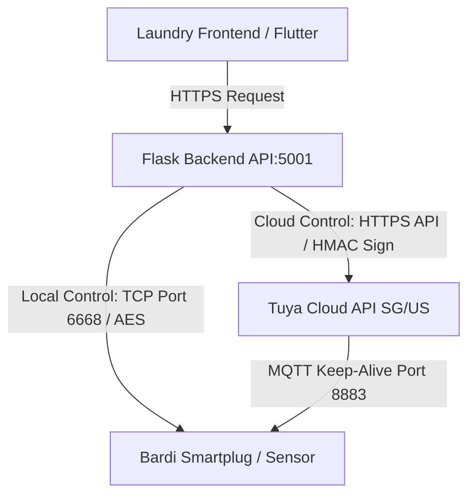

# Bardi (Tuya) Smart Device Integration Guide

This guide documents the architecture, decompiled findings, credentials, and API bridge endpoints for integrating Bardi (Tuya-based) smart devices (such as smartplugs or sensors) into the laundry management system.

---

## 1. System Architecture

Bardi smart devices run on the global **Tuya IoT Platform**. The laundry system can interact with these devices using two parallel pathways:



### Local LAN Control (Same Wi-Fi)
* **Protocol**: TCP Socket connection on port `6668` directly to the device's local IP address.
* **Security**: AES encrypted payloads. Requires the device's **`local_key`** (obtained once from the Tuya Cloud).
* **Dependencies**: Completely independent of the internet. Works offline as long as the backend server and smartplugs are on the same Wi-Fi router/subnet.

### Cloud WAN Control (Different Wi-Fi / Over the Internet)
* **Protocol**: HTTPS Requests to Tuya's Regional API endpoint.
* **Security**: Signed requests utilizing `ACCESS_ID` and `ACCESS_SECRET`.
* **Dependencies**: Requires active internet connections on both the backend server and the smartplugs. Commands are sent to Tuya Cloud, which pushes them to the device via MQTT.

---

## 2. Decompilation & SDK Findings

Decompilation of the Bardi Smart Home app (`com.bardi.smart.home`) revealed the following:
* **White-Label SDK**: Bardi uses Tuya's white-label integration. Packages are named under `com.thingclips.smart` / `com.thingclips.sdk`.
* **Core Application Initialization**: Set up in `com.smart.app.SmartApplication` which runs `ThingSmartSdk.init(this)`.
* **Hardcoded SDK Credentials**: Located in `com.thingclips.sample.BuildConfig` (used internally by the app to connect to Bardi/Tuya API gateways):
  * **AppKey**: `d8tqu7k48xfm3nuvqyrg`
  * **Secret**: `gg7vh4ade7x5pwg4wttkdsd5qyxrdys8`
  * **TTID**: `bardismartlife`

---

## 3. Active Credentials & Devices

The system is configured under the **Western America Data Center (US)** region project `test` linking the user's Bardi/Smart Life App account:

### API Credentials
* **Access ID / Client ID**: `gst7mf5yytp73c9cvqjq`
* **Access Secret / Client Secret**: `3d909f01f5ad4d96aae95a7b454d8957`
* **App Account UID**: `az1733062861059ZHSHA`
* **Endpoint URL**: `https://openapi.tuyaus.com`

### Discovered Devices (Gas Sensors / Plugs)
These devices are registered under the project and their static local keys are:

| Device Name | Device ID | **Local Key (AES Key)** | Category | Status |
| :--- | :--- | :--- | :--- | :--- |
| **Pengering 4** | `eb5e226d14e09b3603cevj` | `{7tMZrC&Lmo4mw0M` | `cz` (Smart Plug EU02A) | Online |
| **Gas sensor 4** | `eb7930462595d2b711i27g` | `v@*:LUc{UXwRT]DR` | `rqbj` (Gas sensor) | Online |
| **Gas sensor** | `eb2604544ab5fb9623dbs6` | `.j3+ncbSEkV141[d` | `rqbj` (Gas sensor) | Online |
| **Gas sensor 3** | `eb7ae36d68f73dc5fc4ufi` | `F<61&+uJ+qF.9:kg` | `rqbj` (Gas sensor) | Online |
| **Gas sensor 2** | `eb81e69ad4372afc68wobk` | `4^^Wtw6?l$cE;MVt` | `rqbj` (Gas sensor) | Online |

---

## 4. Flask API Bridge Endpoint

A dynamic bridge endpoint has been added to the Flask API backend in [main.py](file:///c:/Work/project%20laundry/laundry/main.py):

* **Endpoint**: `/api/tuya/sync-keys`
* **Method**: `POST`
* **Port**: `5001` (Flask `api_app` instance)
* **Headers**: `Content-Type: application/json`
* **Request Body**:
  ```json
  {
    "access_id": "gst7mf5yytp73c9cvqjq",
    "access_secret": "3d909f01f5ad4d96aae95a7b454d8957",
    "app_uid": "az1733062861059ZHSHA",
    "endpoint": "https://openapi.tuyaus.com"
  }
  ```

* **Functionality**: Authenticates using Tuya API v2.0 signature standard, retrieves the complete device list for the specified `app_uid`, and returns a clean JSON list containing all device details, statuses, and `local_key` values.

---

## 5. Python Scripts & Local Control

A helper script has been placed in the workspace at [test_tuya.py](file:///c:/Work/project%20laundry/laundry%20v2/bardi/test_tuya.py). It uses the `tinytuya` Python library.

### To sync keys and scan local network:
```bash
# Run this from the terminal to pull all keys and generate 'devices.json'
python test_tuya.py
```

### To control a smartplug locally (No Internet / Port 6668):
For a smartplug device, use this Python snippet:
```python
import tinytuya

DEVICE_ID = "DEVICE_ID_HERE"
IP_ADDRESS = "LOCAL_IP_ADDRESS_HERE"
LOCAL_KEY = "LOCAL_KEY_HERE"

# Initialize local device
plug = tinytuya.OutletDevice(DEVICE_ID, IP_ADDRESS, LOCAL_KEY)
plug.set_version(3.3) # Set to 3.3 or 3.4 depending on device model

# Turn ON (DP 1 = True)
plug.turn_on()

# Turn OFF (DP 1 = False)
# plug.turn_off()
```

### To control a smartplug via Cloud API (Different Wi-Fi / WAN):
```python
import tinytuya

c = tinytuya.Cloud(
    apiRegion="us",
    apiKey="gst7mf5yytp73c9cvqjq",
    apiSecret="3d909f01f5ad4d96aae95a7b454d8957"
)

# Command to turn ON
commands = {
    "commands": [
        {
            "code": "switch_1",
            "value": True
        }
    ]
}
c.sendcommand("DEVICE_ID_HERE", commands)
```

---

## 6. Cara Kerja Pengambilan Perangkat (Device Retrieval Logic)

Bagi agen/developer selanjutnya, harap perhatikan logika krusial berikut mengenai cara sistem ini menarik (retrieve) daftar perangkat:

### Perbedaan UID Developer vs. UID Aplikasi HP (Sangat Penting)
* **UID Developer**: Ketika sistem backend meminta Token Akses dari `/v1.0/token`, respons API akan menyertakan variabel `uid` milik akun Developer utama Anda. Jika Anda memanggil endpoint `/v1.0/users/{developer_uid}/devices`, hasilnya akan **selalu kosong `[]`** karena perangkat fisik tidak dipasangkan ke akun developer web, melainkan ke aplikasi HP Anda.
* **UID Aplikasi HP (App UID)**: Perangkat laundry dipasangkan di aplikasi HP (Bardi/Smart Life). Saat Anda menautkan akun aplikasi HP tersebut ke project Cloud Tuya (melalui scan QR Code di tab *Devices* -> *Link App Account*), Tuya akan men-generate UID khusus untuk akun HP tersebut: **`az1733062861059ZHSHA`**.
* **Kesimpulan**: Untuk mendapatkan data perangkat beserta `localKey`-nya, sistem **harus** memanggil endpoint `/v1.0/users/{APP_UID}/devices` menggunakan `APP_UID` di atas.

### Pemetaan Endpoint Wilayah (Regional Endpoint Lock)
* Kunci akses API terikat erat dengan wilayah server saat project dibuat.
* Karena project Anda terdaftar di **Western America Data Center**, Anda harus mengarahkan request API ke host **`https://openapi.tuyaus.com`** (atau parameter `apiRegion="us"` pada pustaka `tinytuya`). Jika Anda menembak endpoint Singapore/India (`tuyain`) atau China (`tuyacn`), server akan menolak dengan error `clientId is invalid` atau `sign invalid`.
* Logika ini sudah diotomatisasi secara modular baik pada script [control_plug.py](file:///c:/Work/project%20laundry/laundry%20v2/bardi/smartplug_controller/control_plug.py) maupun bridge Flask [main.py](file:///c:/Work/project%20laundry/laundry/main.py).

---

## 7. Logika Timer Hardware & Penanganan Mati Lampu (Fail-Safe & Power Recovery)

Dalam pengoperasian laundry otomatis, faktor keselamatan listrik sangat penting. Sistem ini dirancang memanfaatkan fungsi built-in hardware pada chip smart plug Bardi (Tuya).

### A. Fitur Hitung Mundur Otomatis (Countdown Timer)
Smart plug Bardi memiliki fungsi hitung mundur hardware bernama **`countdown_1`** (dalam satuan detik). 

Untuk menyalakan smart plug selama **40 menit (2400 detik)** lalu mati otomatis secara otomatis, kirimkan perintah ini secara bersamaan:

```json
{
  "commands": [
    {
      "code": "switch_1",
      "value": true
    },
    {
      "code": "countdown_1",
      "value": 2400
    }
  ]
}
```

* **Keuntungan Hardware Timer**: Proses hitung mundur ini dijalankan langsung oleh microchip internal smart plug. Jika koneksi Wi-Fi putus atau komputer server laundry mati mendadak setelah perintah dikirim, **smart plug akan TETAP mati otomatis (OFF) tepat pada menit ke-40**.

### B. Proteksi Mati Listrik (Power Recovery State)
Untuk menghindari perangkat menyala kembali secara tidak terkendali saat listrik hidup setelah pemadaman (mati lampu), konfigurasi **`relay_status`** smart plug harus disetel ke **`"off"`**.

Tiga nilai status pemulihan daya yang tersedia:
* **`"last"`** (Default pabrik): Mengembalikan sakelar ke posisi terakhir sebelum mati lampu. (Jika sedang berjalan, ia akan langsung menyala tanpa pengawasan saat listrik kembali menyala, namun timer hitung mundur `countdown_1` akan **ter-reset ke 0** sehingga perangkat akan menyala tanpa batas waktu).
* **`"off"`** (Sangat Direkomendasikan): Memaksa smart plug untuk **selalu mati (OFF)** saat baru menerima arus listrik kembali. Ini mengamankan mesin laundry.
* **`"on"`**: Memaksa smart plug untuk langsung menyala.

Untuk menyetel proteksi ini, kirimkan perintah berikut sekali saja via API:

```json
{
  "commands": [
    {
      "code": "relay_status",
      "value": "off"
    }
  ]
}
```

